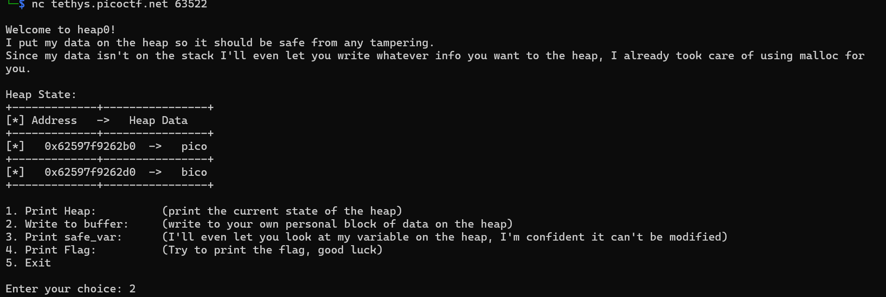
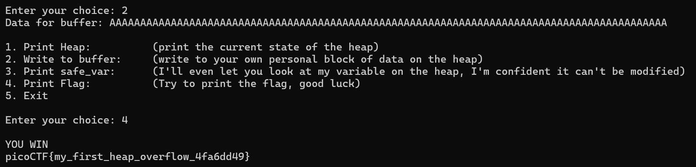

# Heap 0


Are overflows just a stack concern?

Author: Abrxs, pr1or1tyQ

Hint : What part of the heap do you have control over and how far is it from the safe_var?


## Source Code

```
#include <stdio.h>
#include <stdlib.h>
#include <string.h>

#define FLAGSIZE_MAX 64
// amount of memory allocated for input_data
#define INPUT_DATA_SIZE 5
// amount of memory allocated for safe_var
#define SAFE_VAR_SIZE 5

int num_allocs;
char *safe_var;
char *input_data;

void check_win() {
    if (strcmp(safe_var, "bico") != 0) {
        printf("\nYOU WIN\n");

        // Print flag
        char buf[FLAGSIZE_MAX];
        FILE *fd = fopen("flag.txt", "r");
        fgets(buf, FLAGSIZE_MAX, fd);
        printf("%s\n", buf);
        fflush(stdout);

        exit(0);
    } else {
        printf("Looks like everything is still secure!\n");
        printf("\nNo flage for you :(\n");
        fflush(stdout);
    }
}

void print_menu() {
    printf("\n1. Print Heap:\t\t(print the current state of the heap)"
           "\n2. Write to buffer:\t(write to your own personal block of data "
           "on the heap)"
           "\n3. Print safe_var:\t(I'll even let you look at my variable on "
           "the heap, "
           "I'm confident it can't be modified)"
           "\n4. Print Flag:\t\t(Try to print the flag, good luck)"
           "\n5. Exit\n\nEnter your choice: ");
    fflush(stdout);
}

void init() {
    printf("\nWelcome to heap0!\n");
    printf(
        "I put my data on the heap so it should be safe from any tampering.\n");
    printf("Since my data isn't on the stack I'll even let you write whatever "
           "info you want to the heap, I already took care of using malloc for "
           "you.\n\n");
    fflush(stdout);
    input_data = malloc(INPUT_DATA_SIZE);
    strncpy(input_data, "pico", INPUT_DATA_SIZE);
    safe_var = malloc(SAFE_VAR_SIZE);
    strncpy(safe_var, "bico", SAFE_VAR_SIZE);
}

void write_buffer() {
    printf("Data for buffer: ");
    fflush(stdout);
    scanf("%s", input_data);
}

void print_heap() {
    printf("Heap State:\n");
    printf("+-------------+----------------+\n");
    printf("[*] Address   ->   Heap Data   \n");
    printf("+-------------+----------------+\n");
    printf("[*]   %p  ->   %s\n", input_data, input_data);
    printf("+-------------+----------------+\n");
    printf("[*]   %p  ->   %s\n", safe_var, safe_var);
    printf("+-------------+----------------+\n");
    fflush(stdout);
}

int main(void) {

    // Setup
    init();
    print_heap();

    int choice;

    while (1) {
        print_menu();
	int rval = scanf("%d", &choice);
	if (rval == EOF){
	    exit(0);
	}
        if (rval != 1) {
            //printf("Invalid input. Please enter a valid choice.\n");
            //fflush(stdout);
            // Clear input buffer
            //while (getchar() != '\n');
            //continue;
	    exit(0);
        }

        switch (choice) {
        case 1:
            // print heap
            print_heap();
            break;
        case 2:
            write_buffer();
            break;
        case 3:
            // print safe_var
            printf("\n\nTake a look at my variable: safe_var = %s\n\n",
                   safe_var);
            fflush(stdout);
            break;
        case 4:
            // Check for win condition
            check_win();
            break;
        case 5:
            // exit
            return 0;
        default:
            printf("Invalid choice\n");
            fflush(stdout);
        }
    }
}
```
## Solver

Kerentanan terlihat di bagian fungsi innit(), tepatnya di baris kode ini:
```
input_data = malloc(INPUT_DATA_SIZE);
    strncpy(input_data, "pico", INPUT_DATA_SIZE);
    safe_var = malloc(SAFE_VAR_SIZE);
    strncpy(safe_var, "bico", SAFE_VAR_SIZE);
```
dalam banyak implementasi heap manager (seperti ptmalloc di Linux), kedua blok memori ini akan diletakkan berdekatan di heap. Sementara, pada bagian fungsi write_buffer() 
```
scanf("%s", input_data);
```

Baris kode ini menandakan input akan terus ditampung sampai fungsi menemukan spasi atau baris baru. Berarti, terdapat kemungkinan untuk melakukan heap overflow.
```
if (strcmp(safe_var, "bico") != 0)
```
dalam pengecekan flag, flag akan diberikan jika isi dari safe_var tidak sama dengan 0. Berarti kita diminta untuk meng-overwrite isi safe_var.



Jika kita mengurangi 2 alamat yang terdapat pada heap, kita akan menemukan offset sebesar 32. Masukkan input ke dalam buffer sebanyak > 32 karakter untuk memenuhi offset dan menimpa isi safe_var


#### FLAG: `picoCTF{my_first_heap_overflow_4fa6dd49}`