# Quizplot #
 
## Overview ##
Author: Aditya Sudhansu

Category: [Binary Exploitation](../)

## Description ##

Solve the quiz.Download the source code to answer questions here.Download the binary to answer questions here. Connect with the challenge instance here:
nc lonely-island.picoctf.net 53234
Hint 1: Analyze the source code and binary to answer the questions.
Hint 2: Answering all 13 questions correctly gives you the flag.

## Approach ##

Ini isi vuln.c 

```
#include <stdio.h>
#include <stdlib.h>

/*
This is not the challenge, just a template to answer the questions.
To get the flag, answer all the questions.
There are no bugs in the quiz.
There are 0xD questions in total.

*/

void win(){
        system("cat flag.txt");
}

void vuln(){
        char buffer[0x15] = {0};
        fprintf(stdout, "\nEnter payload: ");
        fgets(buffer, 0x90, stdin);
}

void main(){
        vuln();
}
```

Jika kita masuk ke koneksi nc lonely-island.picoctf.net 53234, 

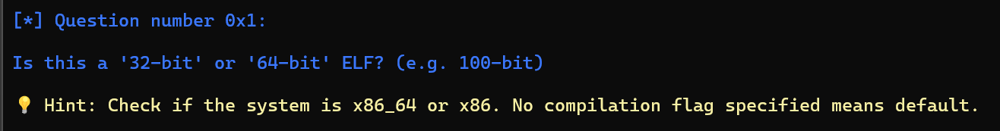

Masukkan command file ./vuln untuk mengecek tipe file
└─$ file ./vuln
./vuln: ELF 64-bit LSB executable, x86-64, version 1 (SYSV), dynamically linked, interpreter /lib64/ld-linux-x86-64.so.2, BuildID[sha1]=19251d430d5dd4b44a3e8489a8c76f1894676f7d, for GNU/Linux 3.2.0, not stripped
Jawaban: 64-bit

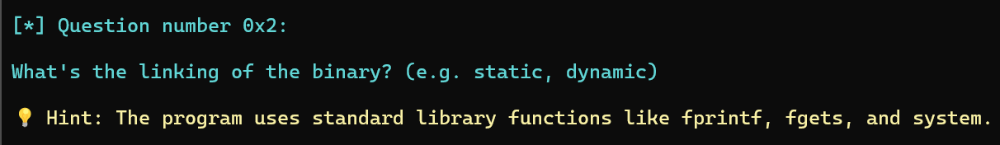

Perbedaan static dan dynamic adalah static linking menanam library langsung di program menggunakan libc.a, sementara di dynamic linking executable hanya memuat referensi ke library eksternal yang akan dipanggil saat runtime menggunakan libc.so
└─$ ldd vuln
        linux-vdso.so.1 (0x00007fffda7a7000)
        libc.so.6 => /usr/lib/x86_64-linux-gnu/libc.so.6 (0x00007f8ae5860000)
        /lib64/ld-linux-x86-64.so.2 (0x00007f8ae5a65000)
Jawaban: dynamic

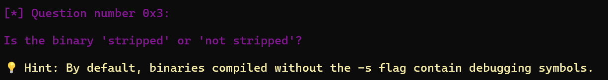

└─$ checksec ./vuln
[*] '/home'
    Arch:       amd64-64-little
    RELRO:      Partial RELRO
    Stack:      No canary found
    NX:         NX enabled
    PIE:        No PIE (0x400000)
    SHSTK:      Enabled
    IBT:        Enabled
    Stripped:   No
Jawaban: not stripped

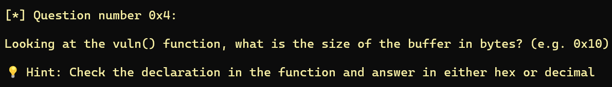

Dapat dilihat di dalam source code vuln.c
char buffer[0x15] = {0};
Jawaban: 0x15

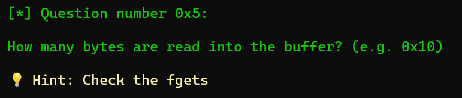

fgets(buffer, 0x90, stdin);
Jawaban: 0x90

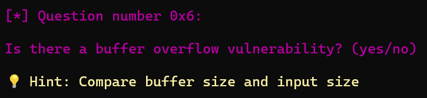

Terdapat perbedaan besar buffer dengan besar input sehingga masih memungkinkan untuk mengalami buffer overflow meski menggunakan fgets
Jawaban: yes

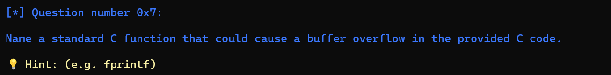

Fgets aadalah fungsi yang bisa menyebabkan overflow karena dia menyimpan besar input yang lebih besar dari besar buffer
Jawaban: fgets

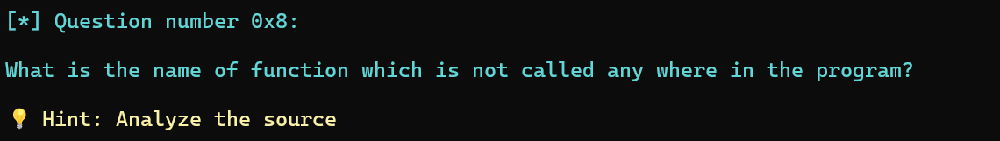

Seperti yang dapat dilihat di source code, fungsi main() memanggil fungsi vuln(), sementara fungsi win() tidak dipanggil sama sekali baik di vuln() maupun main().
Jawaban: win

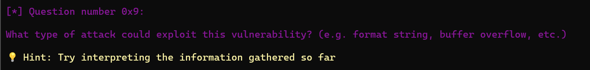

Seperti yang sudah diindikasikan di soal sebelumnya
Jawaban: buffer overflow

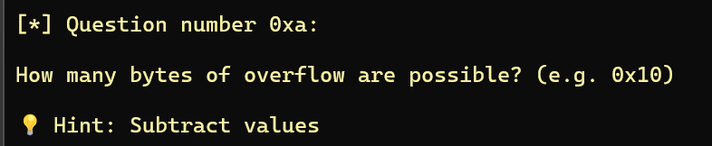

0x90 – 0x15 = 0x7B
Jawaban: 0x7B

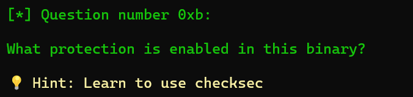

└─$ checksec ./vuln
[*] '/home'
    Arch:       amd64-64-little
    RELRO:      Partial RELRO
    Stack:      No canary found
    NX:         NX enabled
    PIE:        No PIE (0x400000)
    SHSTK:      Enabled
    IBT:        Enabled
    Stripped:   No
Jawaban: NX

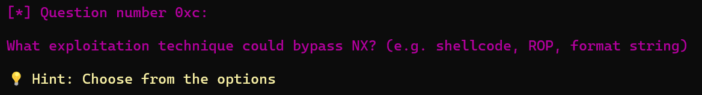

Jawaban: ROP

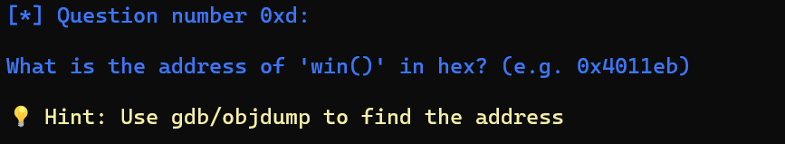

0000000000401176 <win>:
  401176:       f3 0f 1e fa             endbr64
  40117a:       55                      push   %rbp
  40117b:       48 89 e5                mov    %rsp,%rbp
  40117e:       bf 04 20 40 00          mov    $0x402004,%edi
  401183:       e8 d8 fe ff ff          call   401060 <system@plt>
  401188:       90                      nop
  401189:       5d                      pop    %rbp
  40118a:       c3                      ret
Jawaban: 0x401176

### Flag: `picoCTF{my_bIn@4y_3xpl0it_fL@g_0353e5a1}`