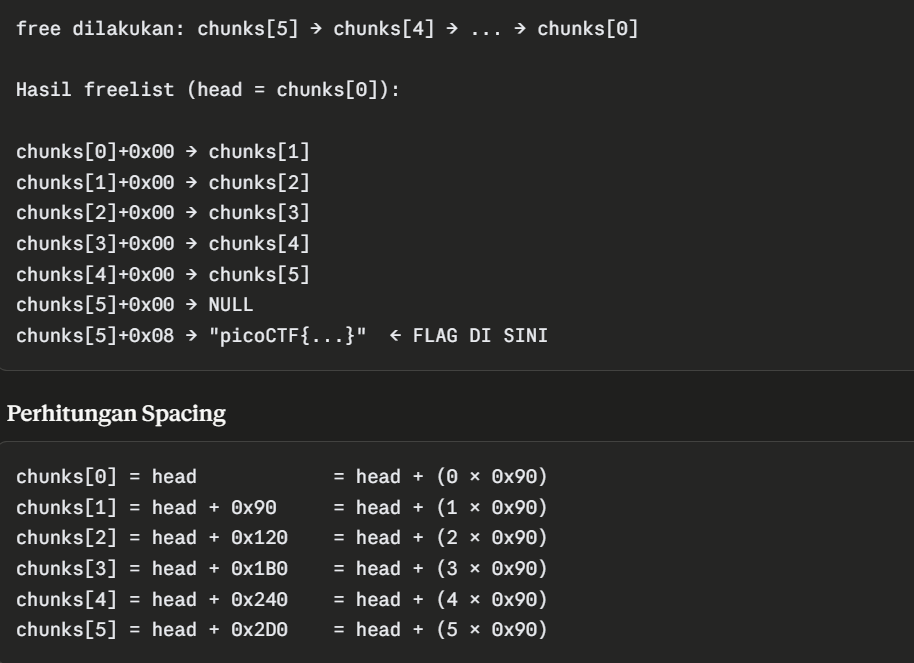
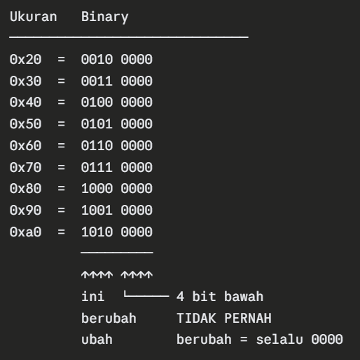
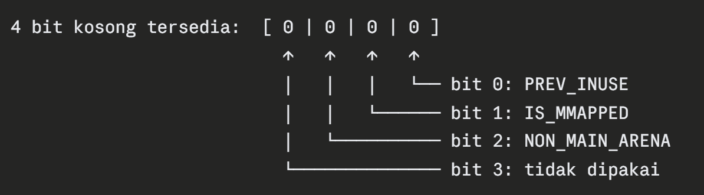
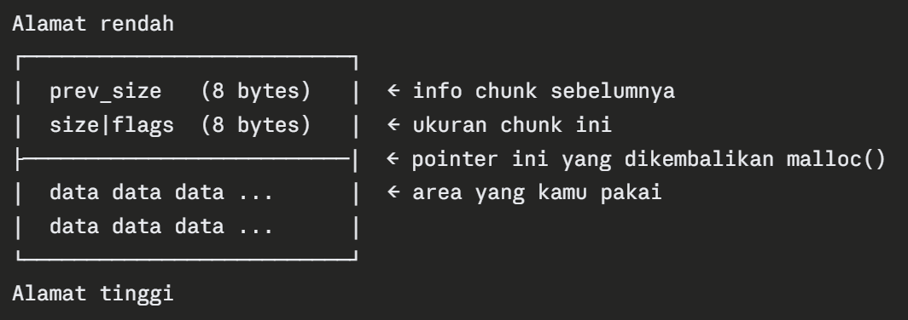

# Tea Cash


You’ve stumbled upon a mysterious cash register that doesn’t keep money — it keeps secrets in memory. Traverse the free list and find all the free chunks to get to the flag. 

nc candy-mountain.picoctf.net 61284

Author: Aditya Sudhansu

Hint : It may be helpful to read a little bit on GLIBC's tcache.

Hint : Use GDB for memory analysis

Hint : Create a local flag.txt and local environment for testings
## Source Code

```
#define _GNU_SOURCE
#include <stdio.h>
#include <stdlib.h>
#include <string.h>
#include <stdint.h>
#include <inttypes.h>

#define CHUNK_COUNT 6
#define CHUNK_SIZE 0x80
#define FLAG_FILE "flag.txt"
#define FLAG_OFFSET (sizeof(void *))

static int is_known_chunk(void *p, void *chunks[], int n) {
    for (int i = 0; i < n; ++i) {
        if (chunks[i] == p) return 1;
    }
    return 0;
}
int main(void) {
    setvbuf(stdout, NULL, _IONBF, 0);
    setvbuf(stderr, NULL, _IONBF, 0);
    void *chunks[CHUNK_COUNT];
    char flag_buf[256] = {0};
    FILE *f = fopen(FLAG_FILE, "r");
    if (!f) {
        fprintf(stderr, "Could not open %s\n", FLAG_FILE);
        return 1;
    }
    if (!fgets(flag_buf, sizeof(flag_buf), f)) {
        fclose(f);
        fprintf(stderr, "Could not read flag from %s\n", FLAG_FILE);
        return 1;
    }
    fclose(f);

    size_t flen = strlen(flag_buf);
    if (flen && flag_buf[flen-1] == '\n') {
        flag_buf[flen-1] = '\0';
        flen--;
    }
    if (FLAG_OFFSET + flen >= CHUNK_SIZE) {
        fprintf(stderr, "Flag too large for chunk. Increase CHUNK_SIZE or reduce flag length.\n");
        return 1;
    }
    for (int i = 0; i < CHUNK_COUNT; ++i) {
        chunks[i] = malloc(CHUNK_SIZE);
        if (!chunks[i]) {
            fprintf(stderr, "malloc failed at i=%d\n", i);
            for (int j = 0; j < i; ++j) free(chunks[j]);
            return 1;
        }
        memset(chunks[i], 0, CHUNK_SIZE);
    }
    memcpy((char*)chunks[CHUNK_COUNT-1] + FLAG_OFFSET, flag_buf, flen + 1);
    void *head = chunks[0];
    printf("tcache head (start of free list) -> %p\n", head);
for (int i = CHUNK_COUNT - 1; i >= 0; --i) {
    free(chunks[i]);
}

    void *expected = head;
    for (int i = 0; i < CHUNK_COUNT; ++i) {
        void *user_addr = NULL;
        printf("Chunk %d address: ", i+1);
        if (scanf("%p", &user_addr) != 1) {
            fprintf(stderr, "Invalid input. Exiting.\n");
            return 1;
        }

        if (user_addr != expected) {
            fprintf(stderr, "Wrong address. Got %p. Exiting.\n", user_addr);
            return 1;
        }

        void *next = NULL;
        memcpy(&next, user_addr, sizeof(void *));

        if (next != NULL && !is_known_chunk(next, chunks, CHUNK_COUNT)) {
            fprintf(stderr, "Detected invalid next pointer value %p (not one of allocated chunks). Aborting to avoid crash.\n", next);
            fprintf(stderr, "Dump of first 16 bytes at %p: ", user_addr);
            unsigned char *b = user_addr;
            for (size_t z = 0; z < 16; ++z) {
                fprintf(stderr, "%02x ", b[z]);
            }
            fprintf(stderr, "\n");
            return 1;
        }

        expected = next;
    }
    char *flag_loc = (char*)chunks[CHUNK_COUNT-1] + FLAG_OFFSET;
    printf("Correct traversal! Flag: %s\n", flag_loc);

    return 0;
}
```
## Solve
```
└─$ strings libc.so.6 | grep "release version"

GNU C Library (Ubuntu GLIBC 2.27-3ubuntu1.2) stable release version 2.27.
```
Versi 2.27 penting karena:
1. Tcache sudah ada (diperkenalkan di 2.26)
2. Belum ada safe-linking (XOR obfuscation baru di 2.32+)
3. Next pointer di tcache tersimpan as-is (plaintext)

Heapedit adalah binary 64-bit yang menjadi executable utama yang telah dilink dengan libc.so.6. Makefile.share berisi instruksi kompilasi dan penggunaan libc yang disertakan dan memastikan binary berjalan dengan libc.so.6 lokal bukan libc sistem.

Tugas sekarang adalah berpindah dari chunk awal sampai chunk 6 dengan memasukkan alamat memori setiap chunk untuk mendapatkan flag di chunk ke 6



`#define CHUNK_SIZE 0x80 + 0x10 = 0x90`

Di sini dapat kita ambil kesimpulan bahwa flag terdapat di 1 bit terbawah dari chunk ke 6. Alasannya adalah karena chal ini menggunakan arsitektur 64-bit sehingga mengikuti alignment 64-bit juga



Seperti yang dapat dilihat di atas, kelipatan 16 menyebabkan 4 bit terbawah selalu 0. Oleh karena itu, kita dapat dengan aman menimpa isi di sana tanpa memberikan dampak kepada chunk
Berikut adalah struktur dari 4 bit terbawah

 

Prev_inuse: chunk SEBELUMNYA sedang dipakai (in-use). Glibc pakai ini untuk tau apakah bisa merge/coalesce chunk yang bersebelahan
Is_mapped: chunk ini dialokasikan via mmap() bukan via heap biasa. Malloc() sangat besar (> 128KB default) langsung minta ke OS pakai mmap()
Non_main_arena: chunk ini bukan dari main arena. Program multi-thread, tiap thread punya arena sendiri
Final Payload: 

```
from pwn import *

# Koneksi remote
p = remote('candy-mountain.picoctf.net', 49632)

# Terima hint alamat chunks[0]
line = p.recvline()
log.info(f"Received: {line}")
head = int(line.split(b'-> ')[1].strip(), 16)
log.success(f"Head (chunks[0]) = {hex(head)}")

# Hitung semua alamat chunk
SPACING = 0x90
chunks = [head + i * SPACING for i in range(6)]

for i in range(6):
    log.info(f"chunks[{i}] = {hex(chunks[i])}")

# Traversal: input alamat sesuai urutan freelist
for i in range(6):
    p.recvuntil(b'address: ')
    p.sendline(hex(chunks[i]).encode())
    log.info(f"Sent chunk {i+1}: {hex(chunks[i])}")

# Terima flag
p.interactive()
```

### Flag: `picoCTF{14b2e7db2a0f191398981558fcfe447d}`
## FAQ

#### Apa itu safe linking?

Safe linking memproteksi pointer dengan cara meng-obfuscate (menyamarkan) nilai pointer menggunakan operasi XOR:

`protected_ptr = (ptr >> 12) XOR next_ptr`

#### Apa itu malloc?

Malloc itu fungsi C yang dipake buat ngatur alokasi memori di heap

#### Apa itu chunk?

Setiap kali kita memanggil malloc(size), glibc mengambil sepotong memori dari heap dan mengembalikannya. Potongan itu disebut chunk.

Struktur chunk : 


#### Apa itu tcache?

Thread Local Cache, yaitu "tempat sampah sementara" milik glibc untuk menyimpan chunk yang sudah di-free() agar bisa dipakai ulang dengan cepat. Bentuknya pointer. Chunk yg telah di-free ada di chunk selanjutnya. Tcache adalah pointer yang menunjuk ke lokasi chunk yg free dengan tujuan mempermudah pencarian. Tcache itu salah satu jenis freelist.
